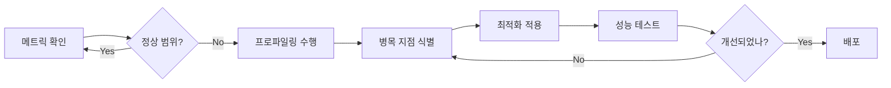

# API Bridge 운영 매뉴얼

API Bridge 시스템의 일상 운영, 모니터링, 트러블슈팅 가이드입니다.

---

## 📋 목차

1. [일상 운영 작업](#일상-운영-작업)
2. [모니터링 메트릭 해석](#모니터링-메트릭-해석)
3. [로그 분석](#로그-분석)
4. [트러블슈팅 가이드](#트러블슈팅-가이드)
5. [성능 이슈 대응](#성능-이슈-대응)
6. [장애 복구 시나리오](#장애-복구-시나리오)

---

## 일상 운영 작업

### 서비스 시작

**Windows (PowerShell)**
```powershell
# 기본 포트(10019)로 시작
.\scripts\start.ps1

# 특정 포트로 시작
.\scripts\start.ps1 -Port 8080
```

**Linux/macOS (Bash)**
```bash
# 기본 포트로 시작
./scripts/start.sh

# 특정 포트로 시작
./scripts/start.sh -p 8080
```

### 서비스 중지

**Graceful Shutdown (권장)**
```powershell
# Windows
.\scripts\shutdown.ps1

# Linux/macOS
./scripts/shutdown.sh
```

Graceful Shutdown은 다음을 보장합니다:
- 진행 중인 요청 완료 (최대 5초 대기)
- DB 연결 정리
- Redis 연결 정리
- 로그 플러시

**강제 중지 (비상시에만)**
```bash
# 프로세스 ID 확인 후 강제 종료
kill -9 <PID>
```

### 서비스 재시작

```powershell
# Windows
.\scripts\shutdown.ps1
.\scripts\start.ps1

# Linux/macOS
./scripts/shutdown.sh && ./scripts/start.sh
```

### 헬스 체크

```bash
# 기본 헬스 체크
curl http://localhost:10019/health

# 상세 준비 상태 체크 (DB, Redis 연결 확인)
curl http://localhost:10019/ready

# 시스템 상태 조회
curl http://localhost:10019/api/v1/status
```

**정상 응답**:
```json
{
  "status": "ok",
  "service": "api-bridge",
  "version": "0.1.0"
}
```

---

## 모니터링 메트릭 해석

### Prometheus 메트릭 확인

메트릭 엔드포인트:
```bash
curl http://localhost:10019/metrics
```

### 주요 메트릭

#### 1. API 호출 메트릭

**api_bridge_requests_total**
- Type: Counter
- 의미: 총 API 요청 수
- Labels: method, path, status_code
- 정상 범위: 지속적으로 증가

**분석 방법**:
```promql
# 초당 요청 수 (TPS)
rate(api_bridge_requests_total[1m])

# HTTP 상태 코드별 분포
sum by(status_code) (rate(api_bridge_requests_total[5m]))

# 에러율 (5xx)
sum(rate(api_bridge_requests_total{status_code=~"5.."}[5m])) 
/ 
sum(rate(api_bridge_requests_total[5m]))
```

#### 2. 응답 시간 메트릭

**api_bridge_request_duration_seconds**
- Type: Histogram
- 의미: 요청 처리 시간 분포
- Buckets: 0.001, 0.01, 0.05, 0.1, 0.5, 1, 5
- 정상 범위: p95 < 0.03 (30ms)

**분석 방법**:
```promql
# p50, p95, p99 레이턴시
histogram_quantile(0.5, sum(rate(api_bridge_request_duration_seconds_bucket[5m])) by (le))
histogram_quantile(0.95, sum(rate(api_bridge_request_duration_seconds_bucket[5m])) by (le))
histogram_quantile(0.99, sum(rate(api_bridge_request_duration_seconds_bucket[5m])) by (le))
```

**알람 기준**:
- ⚠️ Warning: p95 > 30ms
- 🚨 Critical: p95 > 100ms

#### 3. 비교 일치율 메트릭

**api_bridge_comparison_match_rate**
- Type: Gauge
- 의미: 레거시/모던 API 응답 일치율 (0.0 ~ 1.0)
- 정상 범위: > 0.95 (95%)

**알람 기준**:
- ⚠️ Warning: match_rate < 0.95
- 🚨 Critical: match_rate < 0.90

#### 4. Circuit Breaker 메트릭

**api_bridge_circuit_breaker_state**
- Type: Gauge
- 의미: Circuit Breaker 상태 (0=Closed, 1=Open, 2=Half-Open)
- Labels: breaker_name
- 정상 상태: 0 (Closed)

**알람 기준**:
- ⚠️ Warning: state = 2 (Half-Open) 5분 이상
- 🚨 Critical: state = 1 (Open)

#### 5. 전환율 메트릭

**api_bridge_transition_rate**
- Type: Gauge
- 의미: PARALLEL → MODERN_ONLY 전환 진행률 (0.0 ~ 1.0)
- 정상 범위: 점진적 증가

---

## 로그 분석

### 로그 위치

```
logs/
├── api-bridge.log         # 일반 로그
├── api-bridge.error.log   # 에러 로그
└── access.log             # 액세스 로그
```

### 로그 포맷

JSON 구조화된 로깅:
```json
{
  "level": "info",
  "time": "2025-10-23T10:30:45Z",
  "trace_id": "abc123def456",
  "message": "processing request",
  "request_id": "req_001",
  "method": "GET",
  "path": "/api/users",
  "duration_ms": 15.3
}
```

### 로그 분석 명령어

**에러 로그 확인**
```bash
# 최근 에러 로그 100개
tail -n 100 logs/api-bridge.error.log | jq

# 특정 에러 메시지 검색
grep "connection refused" logs/api-bridge.error.log

# 에러 발생 추이 (최근 1시간)
grep "\"level\":\"error\"" logs/api-bridge.log | tail -n 1000
```

**응답 시간 분석**
```bash
# 느린 요청 찾기 (>100ms)
cat logs/api-bridge.log | jq 'select(.duration_ms > 100)'

# 평균 응답 시간 계산
cat logs/api-bridge.log | jq '.duration_ms' | awk '{sum+=$1; count++} END {print sum/count}'
```

**Trace ID로 요청 추적**
```bash
# 특정 요청의 전체 로그 추적
grep "abc123def456" logs/api-bridge.log | jq
```

### 주요 로그 레벨

| 레벨 | 용도 | 예시 |
|------|------|------|
| **DEBUG** | 상세 디버깅 정보 | 캐시 조회, 파라미터 값 |
| **INFO** | 일반 정보 | 요청 처리, 서비스 시작/중지 |
| **WARN** | 경고 (복구 가능) | Redis 연결 실패 → Mock 사용 |
| **ERROR** | 에러 (기능 영향) | 외부 API 호출 실패 |
| **FATAL** | 치명적 에러 (서비스 중단) | DB 연결 완전 실패 |

---

## 트러블슈팅 가이드

### 문제: 서비스가 시작되지 않음

**증상**:
```
❌ Failed to initialize dependencies
```

**확인 사항**:
1. 포트 사용 여부 확인
   ```bash
   netstat -ano | findstr :10019  # Windows
   lsof -i :10019                  # Linux/macOS
   ```

2. 설정 파일 확인
   ```bash
   cat config/config.yaml
   ```

3. 로그 확인
   ```bash
   tail -n 50 logs/api-bridge.error.log
   ```

**해결 방법**:
- 포트 충돌: 다른 포트 사용 또는 기존 프로세스 종료
- 설정 오류: `config/config.example.yaml` 참고하여 수정

---

### 문제: 응답이 느림 (응답시간 > 100ms)

**증상**:
```
⚠️ Request taking too long: 150ms
```

**확인 절차**:

1. **메트릭 확인**
   ```bash
   curl http://localhost:10019/metrics | grep duration
   ```

2. **프로파일링 수행**
   ```bash
   # CPU 프로파일 수집
   .\scripts\profile.ps1 -Type cpu -Duration 60
   
   # 분석
   go tool pprof -http=:8081 profiling-results/cpu_profile_*.pprof
   ```

3. **병목 지점 식별**
   - CPU: JSON 직렬화/역직렬화가 느린가?
   - Network: 외부 API 응답이 느린가?
   - Database: DB 쿼리가 느린가?

**해결 방법**:
- JSON 처리 병목: 캐싱 추가, 경량 JSON 라이브러리 사용
- 외부 API 병목: Connection Pool 크기 증가, Timeout 조정
- DB 병목: 쿼리 최적화, 인덱스 추가

---

### 문제: 메모리 사용량 증가

**증상**:
```
⚠️ Memory usage: 500MB (목표: <200MB)
```

**확인 절차**:

1. **메모리 프로파일 수집**
   ```bash
   .\scripts\profile.ps1 -Type mem
   ```

2. **분석**
   ```bash
   go tool pprof -http=:8082 profiling-results/mem_profile_*.pprof
   ```

3. **주요 확인 사항**
   - 메모리 누수: 특정 함수에서 계속 할당만 하는가?
   - 캐시 오버플로: 캐시가 너무 많은 데이터를 보유하는가?
   - 고루틴 누수: 종료되지 않는 고루틴이 있는가?

**해결 방법**:
- 메모리 누수: `defer` 누락 확인, 리소스 정리 추가
- 캐시 오버플로: TTL 단축, 캐시 크기 제한
- 고루틴 누수: Context 취소 처리 추가

---

### 문제: Circuit Breaker가 Open 상태

**증상**:
```
🚨 Circuit breaker 'legacy-api' is OPEN
```

**원인**:
- 외부 API가 연속으로 실패 (기본: 5회 실패)
- 타임아웃 초과

**확인 절차**:

1. **Circuit Breaker 상태 확인**
   ```bash
   curl http://localhost:10019/api/v1/status | jq '.circuit_breakers'
   ```

2. **외부 API 상태 확인**
   ```bash
   curl http://legacy-api:8080/health
   ```

3. **로그 확인**
   ```bash
   grep "circuit_breaker" logs/api-bridge.log | tail -n 20
   ```

**해결 방법**:

**자동 복구 (권장)**:
- Timeout(60초) 후 자동으로 Half-Open → Closed로 복구 시도
- 모니터링만 하고 대기

**수동 개입 (긴급)**:
- 외부 API 수동 점검 및 복구
- Circuit Breaker 임계값 일시적 조정
- 서비스 재시작

---

### 문제: 레거시/모던 API 응답 불일치

**증상**:
```
⚠️ Response mismatch detected: 85% match rate
```

**확인 절차**:

1. **비교 결과 조회**
   ```bash
   # 최근 비교 이력 조회
   curl http://localhost:10019/api/v1/comparisons?limit=10
   ```

2. **차이점 분석**
   ```json
   {
     "match_rate": 0.85,
     "differences": [
       {
         "type": "VALUE_MISMATCH",
         "path": "data.created_at",
         "legacy_value": "2025-10-23T10:30:45Z",
         "modern_value": "2025-10-23T10:30:45.123Z"
       }
     ]
   }
   ```

3. **허용 가능한 차이인지 판단**
   - 시간 포맷 차이: 밀리초 유무
   - 부동소수점 오차: 0.000001 차이
   - 정렬 순서 차이: 배열 순서

**해결 방법**:
- 허용 가능한 차이: 비교 규칙에 예외 추가
- 실제 버그: 모던 API 수정 필요
- 데이터 불일치: 데이터 동기화 문제 해결

---

## 성능 이슈 대응

### 성능 모니터링 프로세스



### 성능 이슈 체크리스트

#### Phase 1: 메트릭 확인
- [ ] Grafana 대시보드에서 TPS/응답시간 확인
- [ ] 에러율 확인 (< 1%)
- [ ] Circuit Breaker 상태 확인 (Closed)

#### Phase 2: 프로파일링
- [ ] CPU 프로파일 수집 (60초)
- [ ] 메모리 프로파일 수집
- [ ] 고루틴 프로파일 수집

#### Phase 3: 병목 지점 분석
- [ ] CPU: 상위 5개 함수 확인
- [ ] 메모리: 상위 5개 할당 위치 확인
- [ ] 고루틴: 블록된 고루틴 확인

#### Phase 4: 최적화 적용
- [ ] Connection Pool 튜닝
- [ ] 워커 풀 크기 조정
- [ ] 캐시 TTL 최적화
- [ ] 불필요한 직렬화 제거

#### Phase 5: 검증
- [ ] 부하 테스트 재실행
- [ ] 메트릭 비교 (Before/After)
- [ ] 회귀 테스트 통과 확인

---

## 장애 복구 시나리오

### Scenario 1: 서비스 완전 중단

**증상**: Health Check 실패, 서비스 응답 없음

**복구 절차**:

1. **서비스 재시작** (1분 이내)
   ```bash
   .\scripts\shutdown.ps1
   .\scripts\start.ps1
   ```

2. **헬스 체크 확인**
   ```bash
   curl http://localhost:10019/health
   ```

3. **로그 확인**
   ```bash
   tail -n 100 logs/api-bridge.error.log
   ```

4. **모니터링 확인** (Grafana)
   - TPS가 정상으로 돌아왔는가?
   - 에러율이 정상 범위인가?

**복구 실패 시**:
- 이전 버전으로 롤백
- 긴급 연락망 가동

---

### Scenario 2: 부분 장애 (일부 API만 실패)

**증상**: 특정 엔드포인트만 에러 반환

**복구 절차**:

1. **문제 엔드포인트 식별**
   ```bash
   grep "status_code=500" logs/api-bridge.log | jq '.path' | sort | uniq -c
   ```

2. **해당 API의 Circuit Breaker 상태 확인**
   ```bash
   curl http://localhost:10019/api/v1/status
   ```

3. **외부 API 상태 확인**
   ```bash
   curl http://legacy-api:8080/api/problematic-endpoint
   ```

4. **임시 조치**
   - Circuit Breaker가 자동 복구할 때까지 대기
   - 또는 해당 엔드포인트 비활성화

---

### Scenario 3: 성능 저하

**증상**: 응답 시간 급증 (100ms → 500ms)

**복구 절차**:

1. **즉시 확인**
   - 외부 API 응답 시간
   - DB 응답 시간
   - 동시 요청 수

2. **긴급 조치**
   ```bash
   # Connection Pool 임시 확대
   # 환경변수로 설정 (서비스 재시작 필요)
   export MAX_IDLE_CONNS_PER_HOST=100
   ```

3. **부하 분산**
   - 추가 인스턴스 기동
   - 로드 밸런서 설정 조정

---

## 📞 긴급 연락망

| 역할 | 담당자 | 연락처 | 백업 |
|------|--------|--------|------|
| **서비스 담당자** | TBD | - | - |
| **인프라 담당자** | TBD | - | - |
| **DBA** | TBD | - | - |

---

## 🔗 참고 자료

- [프로파일링 결과](./PROFILING_RESULTS.md)
- [배포 가이드](./DEPLOYMENT_GUIDE.md)
- [Prometheus 쿼리 가이드](https://prometheus.io/docs/prometheus/latest/querying/basics/)
- [pprof 사용법](https://github.com/google/pprof)

---

**Last Updated**: 2025-10-23
**Version**: 1.0.0

